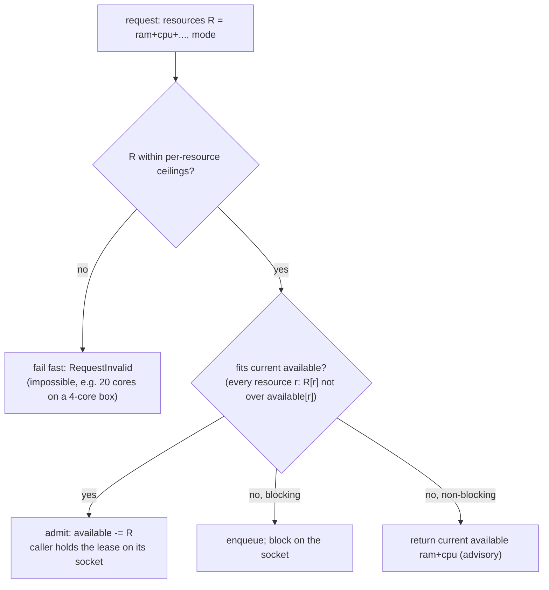
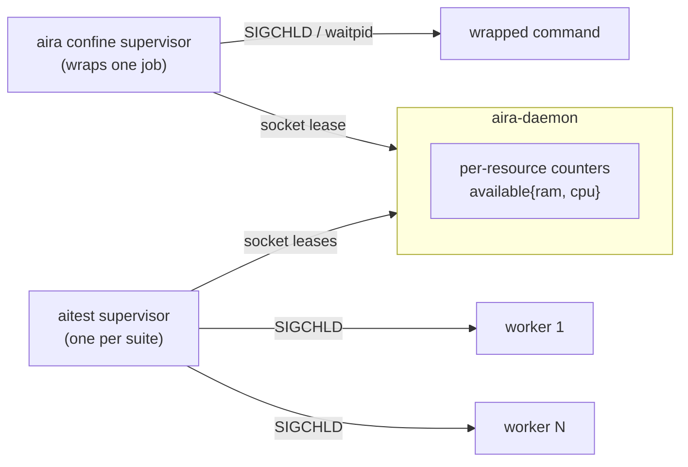
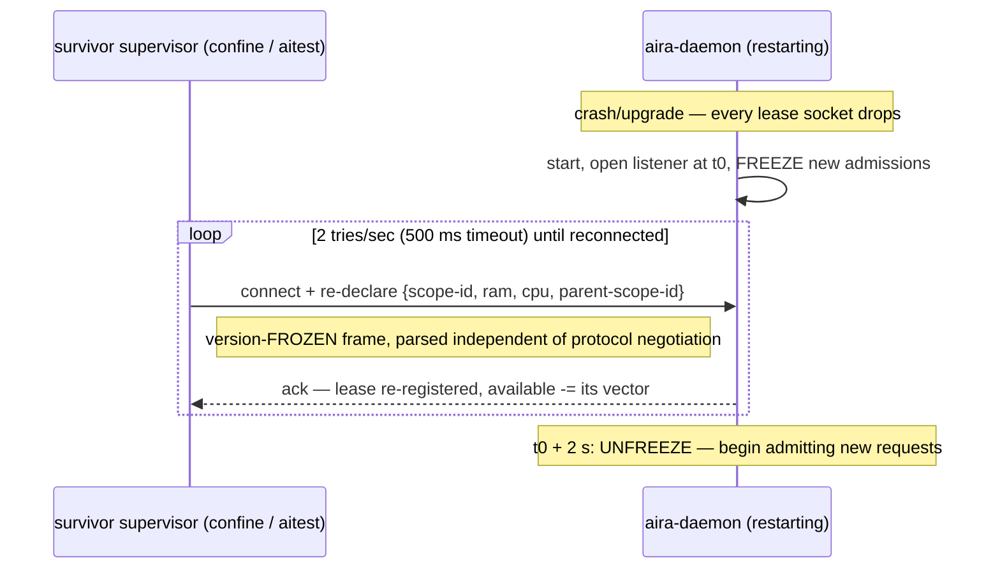

# Simple admission counter — RAM + CPU quota, socket-liveness, rigid reconnect

- **Status**: DESIGN (draft, awaiting plan-review). Supersedes the unified reservation-admission design
  (`2026-09-10-unified-reservation-admission-design.md`) and the Stage-A/B work built against it.
- **Date**: 2026-09-10. **Base**: v0.5 (`420429e`). No users / no backwards-compat obligation, so this is
  a from-scratch rebuild of the admission core, not a migration.
- **Owner-decided shape**: a flat per-resource quota counter; death detected by socket liveness (not a
  cgroup scan); daemon-restart recovery by client reconnect + re-declare; resources handled as a general
  named-scalar map; pure-greedy release drain; no request timeouts.

## 0. Why this replaces the reservation model

A challenge pass during the Stage-B build found the built design was *correct* (green, mutation-tested,
race-clean) but far heavier than the problem needs. Its core is a counter; the weight was in the answers
to one question — *"how does the counter learn something died / left / survived a restart?"* — which it
answered by **polling kernel ground truth** (per-scope `ListConfines` scan + adoption), by **charging live
`memory.current`** (`refreshWaiterCharge`), and through a **relay** (`aira worker-peak`) that split the
requester from the resource-holder. Each is replaced here by the holder simply **telling** the daemon over a
socket it already needs. See the "recurring over-design smells" note in `CLAUDE.md`.

**Retired by this design:** the per-scope scan + restart adoption (`#74`), the AIRA-29 live charge
(`refreshWaiterCharge`) and the `dynamicReserve` flag, the `aira worker-peak` relay + Stage-B scope-binding,
the flock CPU slot-governor (folded into the counter), and the `max_wait_ms` plumbing / worker-admit poll
loop / `AdmitWaitCeiling` typo-guard (no timeouts — §6).

## 1. Problem

Bound total machine RAM and CPU across concurrently-running confined jobs (`aira confine`) and aitest pytest
suites on one box, keeping usage within limits, without OOM-killing the desktop, without project-side
`if CI`. Bounded, not airtight: overshoot → own-cgroup OOM backstop; over-subscription of *declared*
reservations is prevented.

## 2. Core model — one counter per resource

The daemon holds, per resource, `available = ceiling`. A request carries a **resource vector** and a **mode**.



- **Admit**: `∀r: R[r] ≤ available[r]` ⇒ `available -= R`, hand back the grant; the caller holds the lease.
- **Release**: on lease end, `available += R` for every resource the lease held (resource-agnostic).
- **Wait/wake is conjunctive across resources, and any release re-evaluates the queue.** A release of *any*
  resource (a CPU-only free) must wake a waiter that was blocked solely on that resource; the fit-check
  spans all resources. This is the one place the generalisation is more than a copy of the single-resource
  path.
- **Release drain = pure greedy skip-ahead** (§5).

The daemon is a dumb counter: it knows quotas, never tests or jobs. All scheduling judgement lives above it.

## 3. Liveness & release — the holder tells us (no scan)

Every lease is anchored to a **socket the holder already needs** (it uses it to request admission and query
quota). Death of the holder ⇒ socket EOF ⇒ the daemon releases that lease's whole resource vector. There is
no periodic cgroup scan and no live-usage charging.



- **`aira confine <cmd>`**: the confine supervisor holds one socket for the job's lifetime; the command
  dying → supervisor reaps (SIGCHLD) and drops the socket → release.
- **aitest**: the suite's **supervisor** is the single lease-holder — SIGCHLD *downward* to detect its own
  workers dying, one socket *upward* to the daemon, holding a sub-reservation per live worker. No per-worker
  relay and no per-worker daemon socket (this removes the killed-relay bug class outright).
- **Power loss / reboot**: self-cleaning — all RAM/CPU is freed, and a fresh daemon starting at full quota
  is *correct*. No mechanism needed.
- **Orphan edge** (accepted): supervisor killed but a worker reparents and survives → its lease drops while
  RAM is still held, until the confine scope is torn down. Bounded; `oom.group=1` usually takes the whole
  scope on a kill, and the OOM backstop covers the remainder.

## 4. Daemon restart without reboot — reconnect + re-declare

The only case sockets miss: a daemon restart (upgrade via `aira install`, or a crash) while the machine
stays up and jobs live on. Every socket drops at once; jobs keep their RAM/CPU. Recovery is client-driven.



Rules that make it correct:

- **Clients reconnect at 2 tries/sec (500 ms timeout each)** on connection loss and, on reconnect,
  **re-declare every lease they already hold**. A client that *died* during the outage never reconnects, so
  its quota is correctly free — deaths-during-downtime and slow-survivors are the same event to the daemon.
- **The daemon freezes NEW admissions for 2 s, measured from listen-ready** (not process-exec). During the
  freeze it **accepts re-declares immediately** (the RAM/CPU is really held) and makes new admissions
  **wait** — never fail-open to running unadmitted.
- **Re-declare is idempotent**: a SET keyed by `scope-id` (which embeds pid + nanosecond stamp), never an
  ADD, so a double reconnect or partial surviving state can't double-count. Re-declares are accepted
  **unconditionally**; only *new* admissions are budget-gated (a late re-declare that pushes over budget
  just makes the next new admission wait — the ledger self-corrects).
- **The re-declare frame is version-frozen** — the load-bearing invariant. The restart is *usually an
  upgrade*, so the reconnecting client is the OLD binary and the daemon is the NEW one. A single regression
  in this frame silently drops a survivor from the ledger → uncounted RAM → over-admit. Proposed frame,
  fixed forever, parsed before/independent of any version handshake:

  ```
  magic(4B "ARDR") | frame_len(u32) | scope_id(len-prefixed utf8)
                   | ram_bytes(u64) | cpu_millicores(u64) | parent_scope_id(len-prefixed utf8, "" if none)
  ```

  Adding a resource later appends a field *after* a version byte in the NORMAL protocol, never inside this
  frame; the frozen frame keeps exactly these resources. Pin it with a test that feeds an old-format frame
  to the new parser on every build.

**Accepted residual (the one thing the scan gave for free):** the 2 s freeze *bounds* but does not eliminate
a slow/swapped survivor re-declaring after the window opens → a bounded over-admit, caught by the OOM
backstop. Consistent with "bounded, not airtight." Size the freeze off the reconnect interval; verify
daemon listen-ready latency is a small fraction of 2 s (else widen).

## 5. Release drain — pure greedy (accepted starvation gap)

On any release, scan the blocked queue in FIFO order and admit the **first item that now fits** (all
resources), decrement, and repeat until nothing blocked fits — one atomic pass under the single-writer lock.
Terminates because each admit only shrinks the pool.

**Accepted gap, decided deliberately:** "first that *fits*" is skip-ahead, which can **starve a large
request** on the mixed shared slice (a big suite passed over indefinitely by a stream of small jobs) — the
exact case the retired AIRA-59 fairness-freeze handled. Chosen anyway: it is simplest, and within the
homogeneous aitest worker pool (≈equal-sized workers) skip-ahead ≈ FIFO with no starvation. **Re-evaluate
with data**; starvation is already observable as a large oldest-blocked wait via the queue's per-waiter wait
time / `confine --list`, so no guard and no new instrumentation is built now.

## 6. Admission API

Request = `{ resources: {ram, cpu, …}, mode }`. Two modes, no timeout:

- **blocking** (default, the normal path): wait until all resources fit; **fail fast** (`RequestInvalid`)
  when the request exceeds a resource ceiling (impossible), rather than waiting forever.
- **non-blocking**: if it doesn't fit now, return current available `{ram, cpu}` — an **advisory snapshot,
  not a reservation** (availability may move before the caller acts; the follow-up blocking call is the real
  admission). aitest uses this to trim heavy tests out of a worker's next batch and requeue them.

**No request-timeout parameter.** The two modes cover every current caller (must-run → block; best-effort /
adaptive → non-blocking; impossible → fail-fast). The only thing a timeout uniquely buys —
"wait up to T then auto-fallback" — has no consumer, and even it is achievable client-side for free: set a
timer and **close the socket** to cancel (the daemon's "requester gone" path already drops the pending
waiter / releases an in-flight grant). Revisit only with a real bounded-wait-then-fallback case.

**Nested (delegate) availability** — for an aitest worker, "available" = `min(slice-available,
outer-cap-available)` per resource, or the hint overflows the suite's outer cap and `oom.group` kills the
whole suite.

## 7. Resources — general by construction, nothing speculative

Resources are a **map of named scalars**; the admit check, decrement, release, wait/wake and non-blocking
response are all resource-agnostic loops over that map. The **only** per-resource code is the
initial-quota (ceiling) calculation:

| Resource | Ceiling (initial quota) |
|---|---|
| RAM | system RAM − headroom (desktop) · container `memory.max` − headroom (CI) |
| CPU | **2 × cores** — deliberate over-provision; the kernel time-shares, this only caps busyness |

- **CPU is admission-accounting only** — no per-job cgroup `cpu.max`. Cores are a busyness counter; actual
  CPU sharing stays `cpu.weight`-based (aging), as `aira confine` already does. (A hard `cpu.max` would
  contradict the 2× over-provision.) Cores are **integer**.
- Adding resource #3 later = one new ceiling function + one map entry, and — no compat obligation — the wire
  format changes freely. **Not built now:** any resource-type registry / plugin / config-driven resources
  (that would be the "machinery for a future not arriving" smell). The named-scalar map *is* the minimum for
  two homogeneous quotas; the registry would be the over-build.

## 8. Delegate / aitest

- **Suite** (`aira confine --delegate …`): reserves the framework overhead RAM (~1 GB) + **0 cores**. Its
  workers are not provisioned up front.
- **Workers**: the supervisor dynamically sub-reserves `{cpu: 1 (unless annotated), ram}` per worker during
  the run, released on worker teardown via the supervisor's socket lease. Sub-reservations count against
  both the slice budget and the suite's outer cap.
- **v1 scheduler** (build first): a worker claims `{cpu, ram}` for its next test/batch and **blocks** if it
  doesn't fit; heavy tests self-drain to the tail as the finite pool empties. **v2 trim-to-fit** (uses the
  non-blocking mode to trim `annotation > available` tests and requeue) is **deferred** — build only if v1
  utilisation proves insufficient.
- **Terminal guard**: a test whose reservation exceeds the whole pool → fail-fast (`RequestInvalid`), run
  alone after drain, or mark that test `unevaluated`. Never hang the queue.

## 9. Defaults

- `aira confine`: **1 core, 1 GB RAM** — both *declared*. The peak-RSS estimate still sizes the RAM reserve
  for commands seen before; the 1 GB default is the cold-start floor for a first-ever-seen command (err
  high: under-reserving RAM is the OOM direction, over-reserving is only wasted capacity).
- Heavy-parallel confine steps declare `--cpus`; `make -j8` run *unconfined* reserves nothing and is
  absorbed by the 2× CPU headroom and the RAM floor / OOM backstop.

## 10. Invariants

1. `∀r: Σ(admitted reservations of r) ≤ ceiling(r)`.
2. Outer (delegate): `Σ(worker r) ≤ outer-cap(r)`, kernel-enforced by `oom.group`.
3. claim / release / wake atomic under the single-writer lock.
4. **Fail-closed**: no readable budget ⇒ refuse a *new* admission (never run unadmitted); but a re-declare
   during the restart window is always accepted.
5. Bounded, not airtight — OOM backstop is the last line.
6. The version-frozen re-declare frame parses across daemon versions — tested every build.

## 11. Deferred / accepted gaps (written down, not silent)

- Greedy-drain large-request starvation on the shared slice — revisit on data (§5).
- 2 s cold-start over-admit window — bounded, OOM-backstopped (§4).
- aitest v2 trim-to-fit — build on evidence v1 is insufficient (§8).
- Orphaned scope (supervisor dies, worker survives) — bounded (§3).
- Fairness guard, request timeouts, sub-core CPU — none built; add on a real case.

## 12. Open questions for plan-review

- CPU as admission-accounting-only (§7) — confirm (assumed from the 2× over-provision decision).
- The exact re-declare frame (§4) — confirm the field set and the "frozen forever" contract.
- Rebuild-from-scratch vs incremental transform of the current daemon (§0) — this doc assumes rebuild given
  no-compat; confirm the sequencing against the live v0.5 daemon.
