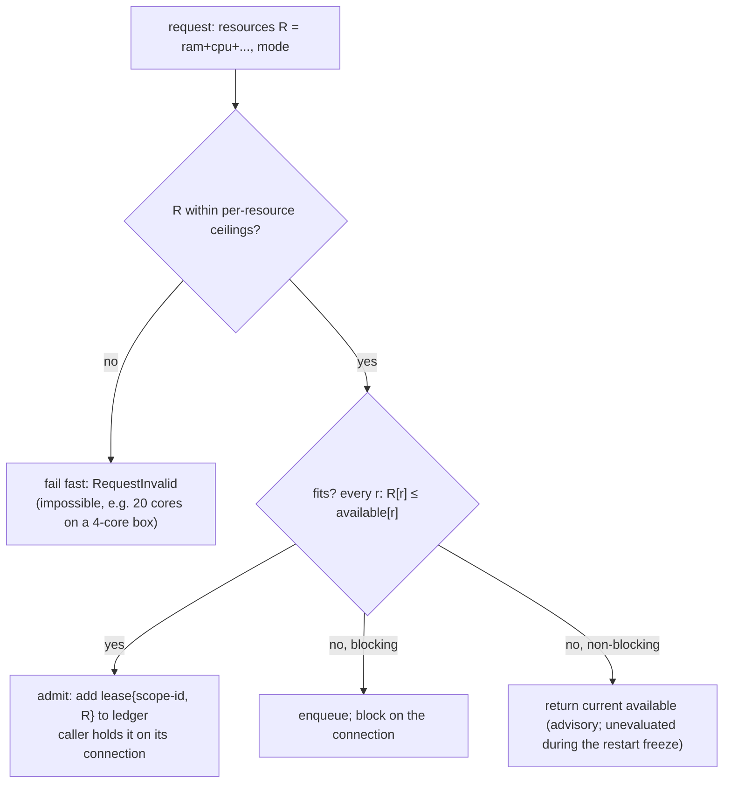
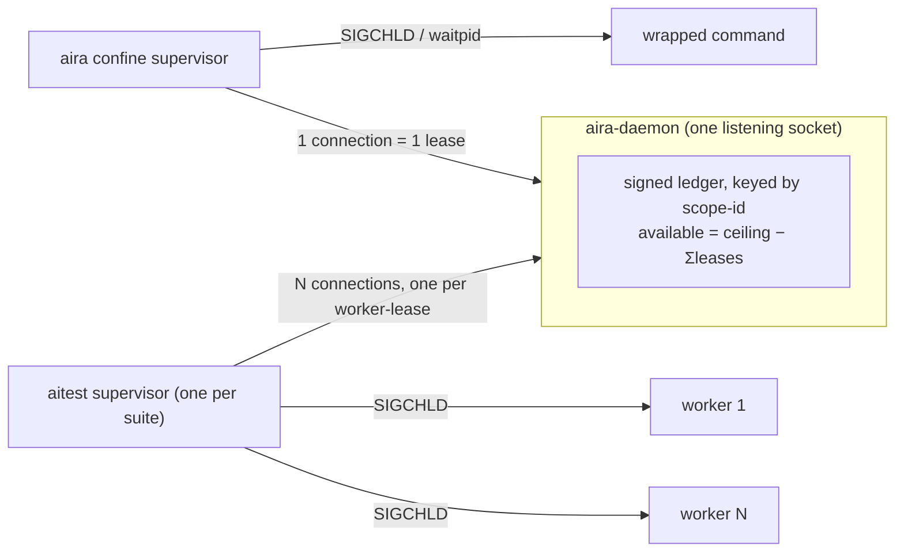

# Simple admission counter — RAM + CPU quota, socket-liveness, rigid reconnect

- **Status**: DESIGN v2 (plan-fixed after the 2026-09-11 plan-review gate returned BLOCK → plan-fix → re-gate).
  Supersedes the unified reservation-admission design (`2026-09-10-unified-reservation-admission-design.md`)
  and the Stage-A/B work built against it. Awaiting re-gate on the deltas.
- **Date**: 2026-09-10 (v1), 2026-09-11 (v2). **Base**: v0.5 (`420429e`).
- **Owner-decided shape**: a flat per-resource quota counter held as a **signed, scope-id-keyed ledger**; death
  detected by socket liveness (already the v0.5 model); daemon-restart recovery by a **ledger dump-on-shutdown +
  kill-probe reload + client reconnect/re-declare** reconciled by idempotency; resources as a general named-scalar
  map;
  **greedy drain inside the homogeneous aitest pool, fairness kept at the shared dev slice; CPU as 2×cores
  accounting-only** (flock governor dropped); no request timeouts; **plenty of data collected, with a CI
  file-dump** for external archival.
- **v2 change-log (gate BLOCK → fixes folded; owner-signed where noted):**
  1. RAM ceiling is the **slice `memory.max` (64 GiB), not system RAM** — v1 §7 would over-admit ~12 GiB → OOM.
  2. `available` is a **signed, scope-id-keyed ledger** `ceiling − Σleases`, not an `+=/−=` counter — kills
     double-count/double-release and makes a late/over re-declare safe (it drives `available` negative → the
     next *new* admission waits), so the freeze is an optimisation, not the safety mechanism.
  3. **Lease released only by the EOF of the connection that is currently its anchor** (compare-and-release
     under the single-writer lock); the daemon **never closes a lease-bearing connection on any error**.
  4. **One connection per lease** to the daemon's single listener — the aitest supervisor holds N connections,
     one per live worker-lease; EOF of that connection releases that one lease; each re-declares independently.
  5. **Bootstrap = ledger dump-on-shutdown + kill-probe reload** (owner design; NO cgroup scan, NO `install`
     guard): the daemon writes the ledger (scope-id, resource vector, client pid) on graceful shutdown; a new
     daemon that finds that file < 10 s old reloads it and `kill -0`s each pid — keeping live leases, dropping
     dead ones — then reconnect + idempotent re-declare re-anchors and refines. No leaf-empty scan guessing, no
     leaked seeds. The one-off first v0.5→new upgrade (no dump exists) is a controlled cutover (§4).
  6. **AIRA-29 dynamic charge stays retired — owner-signed** (§11): declared-only accounting; over-declaring is
     a caller error, and working aitest removes the pressure to hand-guess RAM.
  7. **Fairness kept for the dev shared slice** (AIRA-59 head-of-line + `--exclusive`/drain AIRA-101/185);
     greedy skip-ahead only *within* a suite's homogeneous worker pool; CI (single-tenant) may skip it, data
     decides later — owner-signed.
  8. Frame spec hardened (§4); framing corrections (§0/§3): socket-liveness is **not** the new idea, and
     `oom.group` fires on memory pressure, not on supervisor death.
  9. **Data collection retained + a CI `--dump <file>`** (§12) so external tooling can archive it.
  10. Build path is an **incremental transform of the v0.5 daemon, not a greenfield rewrite** (§14, Q3).

## 0. Why this replaces the reservation model

A challenge pass during the reservation-model Stage-B build found the built design *correct* (green,
mutation-tested, race-clean) but heavier than the problem needs. Its core is a counter; the weight was in the
answers to *"how does the counter learn something died / left / survived a restart?"* — answered by **polling
kernel ground truth** (per-scope `ListConfines` scan + adoption, `#74`), **charging live `memory.current`**
(`refreshWaiterCharge`, AIRA-29), and a **relay** (`aira worker-peak`) splitting requester from holder.

**Framing correction (gate):** socket-liveness release is *not* a new idea — it is **already the primary release
path in v0.5** (`internal/daemon/admit.go:2167-2181`, `2262-2266`): a lease is anchored to the admit connection
and released on peer-EOF. What this design **deletes** is the *periodic scan backstop + live-usage adoption*,
the *dynamic charge*, and the *relays*; what it **adds** is client reconnect + re-declare (plus a
dump-on-shutdown + kill-probe reload, §4) so the socket model also survives a daemon restart. So this is a
**counter rebuild on the existing socket-lease core**, not a from-scratch daemon rewrite (§14).

**Retired:** the *periodic* per-scope scan + live restart-adoption (`#74`); the AIRA-29 live charge
(`refreshWaiterCharge`) + `dynamicReserve`; the `aira worker-peak` relay + reservation-model Stage-B
scope-binding; the flock CPU slot-governor (`internal/daemon/cpuslots.go`, owner-ordered dropped once the daemon
became permanent); the `max_wait_ms` plumbing / worker-admit poll loop / `AdmitWaitCeiling` guard (no timeouts,
§6); the AIRA-114 aggregate bound (folded into the single ceiling); **and the whole cgroup scan/adoption path**
— the ledger is instead persisted across a restart by a dump-on-shutdown + kill-probe reload (§4).

## 1. Problem

Bound total machine RAM and CPU across concurrently-running confined jobs (`aira confine`) and aitest pytest
suites on one box, keeping usage within limits, without OOM-killing the desktop, without project-side `if CI`.
Bounded, not airtight: overshoot → own-cgroup OOM backstop; over-subscription of *declared* reservations is
prevented. The MemAvailable watchdog and per-scope `oom.group` backstop are KEPT untouched as the last line.

## 2. Core model — one signed ledger per resource

The daemon holds a **ledger of live leases keyed by scope-id**, and derives
`available[r] = ceiling[r] − Σ(lease[r] for every live lease)`. A request carries a **resource vector** + **mode**.



- **Admit**: `∀r: R[r] ≤ available[r]` ⇒ add `lease{scope-id, R}`; the caller holds it on its connection.
- **Release**: on lease end, drop that scope-id's lease (resource-agnostic).
- **Signed / idempotent**: `available` is *derived*, never mutated in two places. A re-declare is a SET of that
  scope-id's lease (idempotent — double reconnect, or a scope both dump-reloaded and re-declared, cannot
  double-count). If leases sum past a ceiling, `available` legitimately goes **negative** — no invariant
  violation, it simply makes the next *new* admission wait until releases recover it. This removes
  double-count / double-release / clamp-at-zero over-admit, and is what makes the restart window (§4) correct
  rather than a heuristic.
- **Wait/wake is conjunctive across resources; any release re-evaluates the ONE FIFO queue.** A release of *any*
  resource (a CPU-only free) must wake a waiter blocked solely on that resource; the fit-check spans all
  resources. One queue, not per-resource queues.
- **Release drain**: greedy *inside* the aitest pool, fairness-preserving at the shared slice — §5.

The daemon is a dumb counter: it knows quotas, never tests or jobs. (The peak-RSS *estimate* that sizes a
declared reserve is a store classifier, not daemon scheduling — §9.)

## 3. Liveness & release — the holder tells us (already the v0.5 model)

Every lease is anchored to a **connection the holder already needs** (the daemon exposes one listening socket;
each reservation is one client connection to it). Holder death ⇒ connection EOF ⇒ the daemon drops that lease's
scope-id.



- **Compare-and-release (gate P1-4):** release a lease **only** on peer-EOF of the connection that is *currently*
  its anchor. A re-declare on a new connection **re-anchors** the lease; a stale old connection's later EOF then
  releases nothing. The daemon **never closes a lease-bearing connection on a protocol/version error or
  timeout** — it refuses the *request* and keeps the connection (lease) alive. All under the single-writer lock.
  Pinned by the reconnect-race interleaving test.
- **`aira confine <cmd>`**: the confine supervisor holds one connection for the job's lifetime.
- **aitest**: §8 (one connection per worker-lease, supervisor-held).
- **Power loss / reboot**: self-cleaning — a fresh daemon at full quota is correct (no fresh dump file, so the
  reload is skipped).
- **Orphan edge (accepted, honestly stated — gate correction):** a SIGKILLed supervisor whose worker reparents
  and survives leaves the lease dropped while RAM is held. `oom.group=1` fires on **memory pressure, not on
  supervisor death**, so it does not reliably take the orphan — the **MemAvailable watchdog + own-cgroup OOM
  backstop are the only net**, bounded by orphan lifetime. An intra-slice risk, not "desktop-safe".

## 4. Daemon restart without reboot — dump on shutdown, reload + kill-probe, re-declare

Every connection drops at once; jobs keep their RAM/CPU. The ledger is persisted on graceful shutdown and
reloaded (liveness-checked) on a quick restart, then refined by reconnect/re-declare. **No cgroup scan.** All
timings are localhost.

```mermaid
sequenceDiagram
  participant D as aira-daemon
  participant S as survivor supervisor
  Note over D: graceful shutdown — dump ledger {scope-id, ram, cpu, pid} to a file
  Note over D: (crash: no dump — rely on re-declare below)
  D->>D: start; if dump file mtime < 10s: load it, kill -0 each pid, drop dead leases
  D->>D: open listener at t0, FREEZE new admissions
  loop reconnect 2/sec (500 ms timeout)
    S->>D: ARDR re-declare {scope-id, ram, cpu, parent} per held lease
    D-->>S: 1-byte frozen ack — lease SET (re-anchors to this connection; idempotent, no double-count)
  end
  Note over D: t0 + 2000 ms: UNFREEZE
```

- **Dump on graceful shutdown; reload + kill-probe on startup (owner design, gate P0-1 fix — replaces the
  scan).** On a graceful stop (the `aira install` upgrade path stops the daemon) the daemon writes each live
  lease as `{scope-id, resource vector, client pid}` to a file. A starting daemon that finds that file **< 10 s
  old** reloads it and `kill -0`s each recorded pid: a live pid keeps its lease (the reserve is the *exact*
  dumped value — no leaf-empty scan guessing), a dead pid is dropped (no leaked seed). An absent or ≥ 10 s file
  means a real reboot (or the first upgrade, below) → start at full quota, which is correct.
- **Reconnect/re-declare refines it, idempotently.** As each client reconnects it SETs its own scope-id's lease,
  **re-anchoring** it to the new connection (§3 compare-and-release) and refreshing the reserve. SET-by-scope-id
  means a lease both reloaded and re-declared counts **once**.
- **Reconnect 2/sec (500 ms timeout); freeze new admissions 2000 ms from listen-ready** — localhost, so
  survivors reconnect well inside the window. Re-declares accepted immediately; new admissions wait (never
  fail-open).
- **The signed ledger makes a late re-declare safe:** accepted after the window too; if intervening admissions
  committed, `available` goes negative and the next new admission waits — self-correcting, the ledger invariant
  never violated. Division of labour (gate P3): the **freeze bounds the PHYSICAL over-subscription window** (a
  job admitted against an incomplete ledger has already *launched* — negative `available` cannot retract it),
  while the **signed ledger bounds ledger DRIFT** (double-count / late re-declare). Both are needed.
- **First v0.5→new upgrade (P0, one-off):** v0.5 has neither dump code nor re-declare code
  (`internal/runner/admission_linux.go:689`), so this transition alone has nothing to reload and no clients that
  reconnect — a **controlled cutover** (drain / quiet box) covers it. Every subsequent restart has a dump. The
  MemAvailable watchdog + OOM backstop remain the net throughout.
- **Reloaded leases are UNANCHORED until re-declared, and dropped if they stay so (gate P1-A — the biggest
  risk).** A dump records the *supervisor's* pid, which outlives its workers, so `kill -0` alone would keep a
  retired worker's lease forever (a leak by a different path than the scan's). So a reloaded lease is marked
  `unanchored`; a client's re-declare **re-anchors** it to a live connection; any lease still unanchored at
  **end-of-freeze + a short grace (~10 s) is dropped regardless of pid** — a late re-declare just SETs it again
  (the signed ledger absorbs the transient). `kill -0` (+ process start-tick, retiring pid-recycle) is only an
  *early-drop* optimisation, never the sole keep condition. The restart-under-load merge test must cover a
  worker retiring mid-drain.
- **The re-declare frame is version-frozen** — the load-bearing invariant (restart is usually an *upgrade*, OLD
  client ↔ NEW daemon). Hardened (gate P1-5):
  - **4-byte magic `ARDR` sniffed before any framing/handshake**, with the frozen, tested invariant
    `MaxFrameBytes (16 MB) < magic (0x41524452 ≈ 1.09 GB)`.
  - **A TOTAL parser**: every byte sequence parses or is a hard, LOGGED reject — never a silent/partial drop.
  - **Freeze SEMANTICS, not just layout**: the per-build test feeds an old frame to the new parser and asserts
    the resulting **ledger charge**, not field deserialization.
  - **A frozen 1-byte ack**; **`SO_PEERCRED` same-uid only** (gate P2-C: a scope-id→cgroup-membership check
    would reject every legitimate re-declare — both confine and aitest holders live *outside* their own scope);
    **order-independent**.
  - Frame: `magic(4B "ARDR") | frame_len(u32) | scope_id(len-prefixed utf8) | ram_bytes(u64) |
    cpu_cores(u32 integer) | parent_scope_id(len-prefixed utf8, "" if none)`.
  - A **golden-bytes fixture shared by the Go and Python encoders** (aitest's supervisor is Python).

## 5. Release drain — greedy in the pool, fair at the slice

On any release, scan the blocked FIFO and admit the first item that now fits (all resources), repeat until
nothing fits — one atomic pass under the single-writer lock. Two regimes (gate P1-3, owner-signed):

- **Inside a suite's aitest worker pool** (homogeneous): pure greedy skip-ahead ≈ FIFO, no starvation — use it.
- **At the shared dev slice** (256 MB scripts to multi-GB suites, many sessions): **KEEP AIRA-59 head-of-line
  fairness and `--exclusive`/`aira drain`/`drain-hold` (AIRA-101/185)** — pure-greedy is the inverse of the
  "draining blocks grants" semantics those need. **CI is single-tenant**, so fairness rarely binds and may be
  skipped for now; **data (§12) decides later** whether dev's guard needs tuning.

## 6. Admission API

Request = `{ resources: {ram, cpu, …}, mode }`. Two modes, no timeout:

- **blocking** (default): wait until all resources fit; **fail fast** (`RequestInvalid`) if the request exceeds
  a ceiling (impossible).
- **non-blocking**: return current available `{ram, cpu}` — advisory snapshot, not a reservation; **`unevaluated`
  during the restart freeze** (honesty rule). aitest uses it to trim heavy tests from a worker's next batch.

**No timeout / no per-scope release verb / no multiplex** — because **one connection = one lease** (§8): a
finished lease's connection EOFs; a client wanting bounded-wait closes its connection to cancel. Nested
(delegate) availability = `min(slice-available, outer-cap-available)`, decrementing **both** ledgers.

**On daemon EOF a waiter reconnects and re-requests — never fail-open (gate P1-B).** A blocked or new request
whose connection drops (daemon restart) retries connect at 2/sec with no timeout and re-issues its request,
taking a fresh FIFO position; it must never fall back to an ungoverned launch (this replaces the deleted
client-side flock fallback, §14).

## 7. Resources — general by construction

A **map of named scalars**; admit/decrement/release/wait/wake are resource-agnostic loops. The **only**
per-resource code is the ceiling calc:

| Resource | Ceiling |
|---|---|
| RAM | **`min(aira.slice memory.max, container memory.max in CI) − headroom`**, read from the slice cgroup as v0.5 does (NOT system RAM; slice cap is 64 GiB on a 78.5 GiB box). Decide the AIRA-103/106 pressure ceiling's fate at implementation. |
| CPU | **2 × cores** — over-provision; the kernel time-shares, this caps busyness and leaves room for I/O. **Integer cores.** |

- **CPU is admission-accounting only** — no `cpu.max`; sharing stays `cpu.weight`-based. 2×cores intentionally
  loosens `#49`'s `cpuCount − 1` desktop reserve (owner-decided); desktop protection = `aira.slice cpu.weight <
  desktop` (already in place), kernel handles the 1–2× zone.
- Adding resource #3 later = one ceiling fn + one map entry. **Not built now:** any resource-type
  registry/plugin/config (over-build). The named-scalar map *is* the minimum.

## 8. Delegate / aitest

- **Suite** (`aira confine --delegate …`): reserves framework overhead RAM (~1 GB) + **0 cores**.
- **Workers — one connection per worker-lease, supervisor-held (owner-confirmed):** the aitest supervisor opens
  **one daemon connection per live worker**, each carrying `{cpu: 1 unless annotated, ram, parent_scope_id}` — an
  independent lease. On worker teardown the supervisor closes *that* connection → releases *that* lease (RAM
  returns immediately, not at suite end). On daemon restart the supervisor reconnects each and re-declares each
  independently (no "one frame loses N−1 sub-reserves"). The long-lived supervisor (already SIGCHLD-reaping)
  holds the connections, sidestepping the unverified question of a forked pytest worker holding a daemon fd.
- **v1 scheduler** (build first): a worker claims `{cpu, ram}` for its next test/batch and **blocks** if it
  doesn't fit; heavy tests self-drain to the tail as the pool empties. **v2 trim-to-fit** deferred.
- **Terminal guard**: a test whose reservation exceeds the whole pool → fail-fast, run alone after drain, or mark
  `unevaluated`. Never hang the queue.

## 9. Defaults & the peak-RSS auto-sizer

- `aira confine`: **1 core, 1 GB RAM** declared. The **peak-RSS estimate sizes the RAM reserve for any command
  seen before**; the 1 GB default is only the cold-start floor for a first-ever command (err high).
- **Per-scope `memory.max` containment is UNCHANGED from v0.5 and out of scope here — there is no first-run
  trap.** v0.5 sets the scope cap from the reserve *only* for a daemon-validated, history-derived estimate and
  deliberately leaves a first-run/guessed reserve **uncapped** (`confine_linux.go:985-992` — "enforcing a guess
  as a hard cap would OOM-kill jobs that succeed today"). The admission ledger uses the declared reserve for
  accounting; it does not change how the containment cap is sized. (The gate's P1-8 "first-run OOM trap" was a
  non-problem; this design touches none of it.)
- **The peak-RSS estimate keeps its input via the existing `confine-report` verb — NOT a daemon read at release
  (gate P1-C: my earlier claim was dead code).** The scope is removed *before* the lease connection closes (LIFO
  defer: `releaseAdmission` at `confine_linux.go:716` runs before `cleanup`/`scope.Remove` at `:818`), so
  `memory.peak` is unreadable at EOF. Instead the HOLDER reads `memory.peak` before its own rmdir and sends the
  sample over the `confine-report`/`ReportPeakSample` verb (`confine_linux.go:1408`, `admission_linux.go:791`);
  aitest's supervisor sends its one pool sample the same way (`supervisor.py:1605`). KEEP that verb (§14); the
  estimate is keyed by command signature, independent of the lease. The relay's *transport* is retired, its
  *feedback* is not — so auto-sizing (§11) is not starved.

## 10. Invariants

1. `∀r: Σ(live leases of r) ≤ ceiling(r)` for **new** admissions (a re-declare may transiently push derived
   `available` negative; the next new admission then waits).
2. Outer (delegate): `Σ(worker r) ≤ outer-cap(r)`, kernel-enforced by `oom.group`; admission decrements both.
3. `available` is **derived**, never independently mutated.
4. A lease is released **only** by the EOF of its current-anchor connection; a re-declare re-anchors; the daemon
   never closes a lease-bearing connection on error.
5. claim / release / re-declare / wake atomic under the single-writer lock.
6. **Fail-closed**: no readable budget ⇒ refuse a *new* admission; a re-declare during the restart window is
   always accepted.
7. Bounded, not airtight — MemAvailable watchdog + own-cgroup OOM backstop is the last line.
8. The version-frozen re-declare frame parses across versions and asserts a ledger *charge* — tested every build.

## 11. Deferred / accepted gaps (owner-signed where noted)

- **AIRA-29 reversal (owner-signed):** declared-lifetime reserves reintroduce the *measured* over-reservation
  (33.6 G reserved / 2.6 G used for 62 min; a 4 G request once queued 28+ min while ~20 GB idle). Accepted:
  over-declaring is a caller error; peak-RSS auto-sizes known commands; working aitest removes the pressure to
  hand-guess. The live charge is not re-added (cannot keep both). **Data (§12) measures the residual.**
- **Fairness on CI (owner-signed):** greedy in the pool; dev keeps AIRA-59/101/185; CI may skip — data decides.
- **First v0.5→new upgrade:** a one-off controlled cutover (drain / quiet box) — v0.5 wrote no ledger dump and
  has no re-declare, so there is nothing to reload and no reconnect; every subsequent restart has a dump (§4).
- **2×cores loosens the `#49` desktop CPU reserve (owner-decided):** protection rests on `cpu.weight` (§7).
- **Orphaned scope** (supervisor SIGKILLed, worker survives) — bounded by orphan lifetime; watchdog/OOM is the
  net, `oom.group` does not cover it (§3).
- **aitest v2 trim-to-fit**; **sub-core CPU, request timeouts, resource registry** — none built; add on a case.

## 12. Data collection & CI dump (owner requirement)

The point of the "data decides later" gaps (AIRA-29 residual, CI fairness) is that the data must actually exist.
Keep collecting, cheaply, in the daemon's existing store:

- Per admission: scope-id, requested vector, wait time, grant/deny/fail-fast, and (from the existing peak-RSS
  path) **declared reserve vs observed peak** — this is the AIRA-29 over/under-provision signal.
- Per queue: **oldest-blocked wait** (the starvation signal for the CI-fairness decision), negative-`available`
  excursions (restart-window over-subscription), per-resource utilisation over time.
- Most of this already flows through the peak-RSS estimator and `confine --list`; retain it rather than add new
  machinery.

**CI mode: `aira ... --dump <file>`** writes the collected admission/utilisation records as **JSONL to a file**
(atomic write, honest `unevaluated` for anything not measured). AIRA writes the file only — **something external
to AIRA** (the CI job) ships it to blob storage. No upload integration, no network in the daemon. A dev box can
enable the same dump on demand.

## 13. Open questions — resolved by the gate + owner

- **Q1 CPU accounting-only, 2×cores:** CONFIRMED. Freeze the CPU unit as **integer cores**; desktop protection
  via `cpu.weight` (§7).
- **Q2 frozen re-declare frame:** contract CONFIRMED (correct exception to refuse-on-mixed-version); field set
  hardened per §4.
- **Q3 rebuild vs transform:** **incremental TRANSFORM** (§14).
- **REMAINING (verify at implementation):** confirm the aitest supervisor can hold N connections + reconnect
  cheaply on localhost (§8). The only choice that could still change the §4 frame (repeat count) / §6 (release
  verb) — falls back to a multiplexed connection with an explicit per-scope release verb if N-connections proves
  impractical.

## 14. Build sequencing — incremental transform (gate Q3)

Socket-as-lease + EOF-release, release-on-failed-grant, peer-EOF arbitration, the AIRA-84 read-deadline
discipline, the `--exclusive` lifecycle, and `SO_PEERCRED` **already exist and are tested** (`admit.go:2167-2181`).

- **KEEP**: that socket-lease core; the MemAvailable watchdog; per-scope `oom.group` + `memory.max` containment
  (unchanged from v0.5); `--exclusive`/drain (dev); the peak-RSS estimate + `confine --list`; **the
  `confine-report`/`ReportPeakSample` verb** (the estimate's feedback — gate P1-C).
- **REBUILD**: the ledger as the derived signed `ceiling − Σleases` (§2); add reconnect + re-declare + frozen
  frame + freeze + the dump-on-shutdown / reload+kill-probe with **unanchored-lease-drop** (§4); add the CPU
  resource to the map (§7); one-connection-per-worker-lease **as a worker-admit — the daemon creates the
  sub-scope** (§8); the CI `--dump` (§12).
- **DELETE, each through the two-loop (each is live):** the whole cgroup scan/adoption path (`#74`),
  `refreshWaiterCharge`/`dynamicReserve` (AIRA-29), the `worker-peak` relay *transport* (its sample feed moves to
  `confine-report`, above), the `cpuslots` flock governor, the `max_wait` plumbing, the AIRA-114 aggregate bound,
  **and the client-side flock fallback** (`admission_linux.go:427-445`, gate P1-B — a queued request on daemon
  EOF must reconnect and re-request, never fail-open to an ungoverned launch; AIRA-222's class).
- **ci-shim (`internal/daemon/shim.go`, AIRA-121) — OWNER-DECIDED (2026-09-11): retire the scan entirely; CI
  mode does not need it.** The ci-shim's advisory ledger moves onto the same signed counter (advisory, no cgroup,
  no scan); nothing re-sources a scan anywhere. subpipe's ci-shim advisory mode is preserved via the counter.
- **BUMP `ProtocolVersion`** so a v0.5 client's *new* admission is refused loudly (re-declare is the only
  cross-version path).
- **MERGE GATE**: a real **restart-under-load integration test** (dump on shutdown, reload + kill-probe, dead
  pids dropped, survivors re-declare, no double-count, no over-admit), plus the reconnect-race and
  old-frame→new-parser pins.
- Live swap follows the v0.5 discipline (tests + review + soak; rollback path).

## 15. Gate fold-list — build-time details (Fable confirm-gate P2/P3, apply at implementation)

Captured so they are not lost; none change the design shape.

- **Dump timing / durability (P2-A):** snapshot the ledger *before* `close(stopping)` (`server.go:573`); write
  it fsync+rename as the last act before exit. The freshness threshold must be ≥ `DrainTimeout` (10 s) +
  `RestartSec` (2 s) + margin (~**30 s**, not 10 s) or a slow drain silently skips the reload.
- **Dump records are frozen ARDR frames + pid + process-start-tick (P2-B/P3):** the dump is written by the OLD
  binary and read by the NEW one on upgrade, so use the same frozen encoder as the re-declare frame (one Go
  encoder, one golden fixture); an unparseable record is logged and skipped. Include `parent_scope_id`. Load is
  **consume-once** (rename away on read) so a stale file cannot re-seed twice.
- **Exclusive / drain-hold across restart (P2-D):** neither the dump nor the frame carries exclusivity, so an
  `--exclusive` holder does **not** reconnect — it reports `exclusive=lost` (v0.5's watcher already does this,
  `confine_linux.go:755-795`) rather than silently running contended.
- **Worker lease shape (P2-F):** an aitest worker lease is a *worker-admit* (the daemon creates the sub-scope and
  returns its path + `memory_max`; placement stays in Python via `cgroup.procs`), not a bare resource vector; the
  worker-ID re-seed reads the tree's largest suffix on restart (`worker_admit.go:769-771`) — a one-readdir read
  the design keeps.
- **§3 wording (P3):** "the daemon never closes a lease-bearing connection on error" holds *except at graceful
  shutdown, which closes every lease connection **after** the dump is written*.
- **Unverified (report-as):** that N Python re-declare connections reconnect cheaply on localhost (§13) —
  plausible, measure during Stage-C build.
